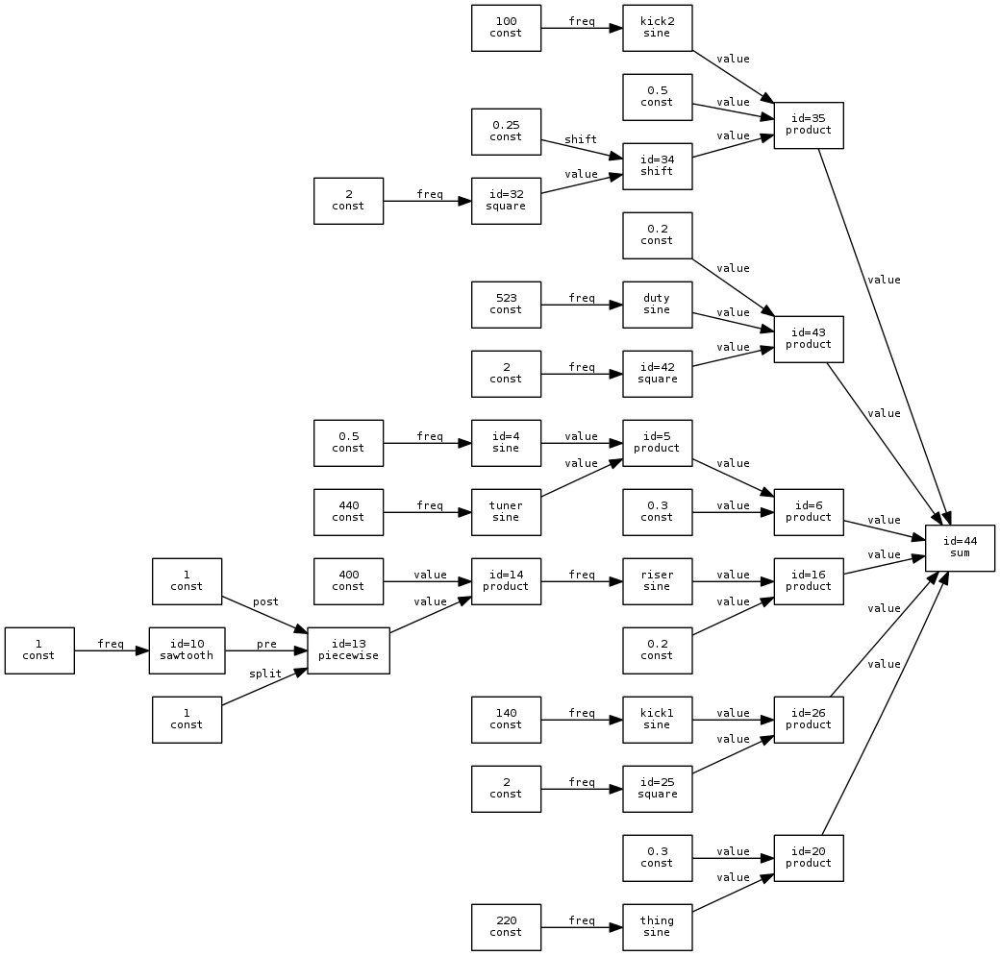

symrep
===
`symrep` is an attempt to make a general-purpose, hierarchical, functional
representation for media using function composition. Graphs that represent some
creative entity are constructed from nested function calls, these graphs can
then be sampled at different parameter values with varying results. `symrep` is
written to be parameter-space agnostic, allowing for it to be used for
everything from 5.1-channel audio to functional representation of 3D models.

For example, this source code for audio synthesis (using the `symrep.audio`
package):

    from symrep import *
    import sys

    n = sum(
        product(
            const(0.3),
            product(
                audio.sine(const(440), name="tuner"),
                audio.sine(const(0.5)),
            )
        ),
        product(
            const(0.2),
            audio.sine(
                product(
                    const(400),
                    piecewise(
                        audio.sawtooth(const(1)),
                        const(1),
                        const(1),
                    ),
                ),
                name="riser",
            )
        ),
        product(
            const(0.3),
            audio.sine(const(220), name="thing"),
        ),
        product(
            audio.sine(const(140), name="kick1"),
            audio.square(const(2), const(0.05)),
        ),
        product(
            const(0.5),
            audio.sine(const(100), name="kick2"),
            shift(
                audio.square(const(2), const(0.05)),
                const(0.25),
            )
        ),
        product(
            const(0.2),
            audio.sine(const(523), name="duty"),
            audio.square(
                const(2),
                audio.sawtooth(const(1. / 60.)),
            ),
        )
    )
    audio.stream_pcm(n, 44100, sys.stdout)

Gives the following graph:

[...and this sound file](examples/sound.wav)
